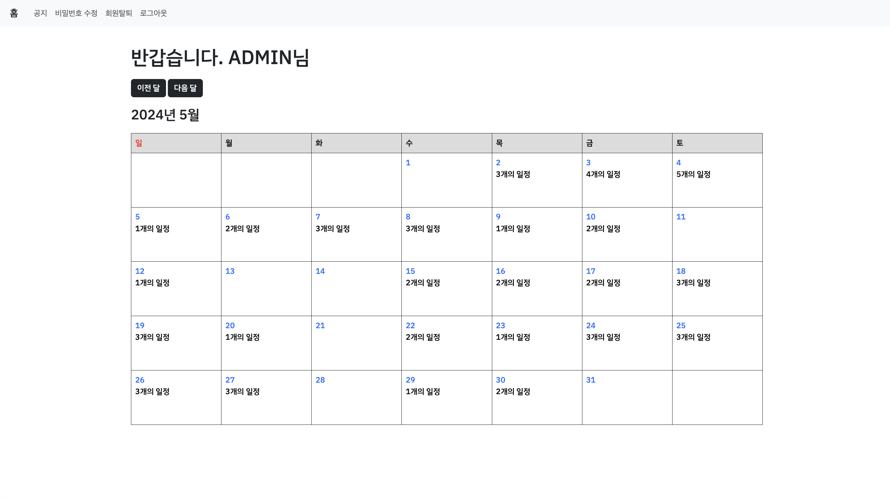

# Diary
> 일정을 기록하는 나만의 diary 웹 사이트입니다.  
스프링을 처음 배울 당시 스프링에 대한 이해도를 높이기 위해 기존의 model1 방식으로 작업했던 프로젝트를 Spring으로 MVC 패턴을 적용하여 리팩토링하였습니다. 
 

⌨️ **Demo Link** 
[로그인 페이지](http://52.78.98.70/diary/login) 
 

## 📍 참여 인원 & 제작 기간
- 참여 인원 : 1명 
- 제작 기간 : 2023.11.30 — 2024.12.14
 

## 📍 사용 기술
Backend
>Java 17 
>Spring Boot 3.2.0 
>MariaDB 10.5.22 
>MyBatis
  
Frontend
>JavaScript(JQuery)
  
Tool
>Maven 
>Git 
>AWS

 

## 📍 ERD 설계

  

## 📍 담당 기능
- 로그인
    - 로그인 성공시 Home 화면으로 이동
    - 로그인 실패시 실패 메시지 출력
 

- 회원가입
    - ID 중복체크
 

- 홈
    - Java 기본 API인 Calendar Class를 사용하여 달력 구현
    - 달력의 날짜 별로 그 날의 일정의 개수 표시
    - Ajax를 사용하여 비동기 통신으로 월별로 달력을 변경
 

- 일정
    - 일정 목록
        - 해당 날짜에 대한 일정 목록 출력
    - 일정 추가
    - 일정 삭제
        - Ajax를 이용해 일정 번호와 날짜를 parameter로 전송하여 비동기 통신으로 일정 삭제
 

- 공지
    - 공지 목록, 공지 추가, 공지 상세
    - 공지 수정
        - 입력한 비밀번호가 일치하면 공지가 수정되고 일치하지 않는다면 알림창으로 표시
    - 공지 삭제
        - 입력한 비밀번호가 일치하면 공지가 삭제되고 일치하지 않는다면 알림창으로 표시
 

- 댓글
    - 댓글 목록
        - 관리자이면 모든 댓글 열람 가능
        - 관리자가 아닌 일반 회원이면 본인의 작성한 댓글이거나 비밀글이 아닌 댓글만 열람 가능
        - 비회원이라면 비밀글이 아닌 댓글만 열람 가능
    - 댓글 추가
        - 비밀글 설정이 가능하도록 구현
    - 댓글 수정
        - 댓글 내용과 비밀글 여부를 수정 가능
        - 입력한 비밀번호가 일치하면 댓글이 수정되고 일치하지 않는다면 알림창으로 표시
    - 댓글 삭제
        - 입력한 비밀번호가 일치하면 댓글이 삭제되고 일치하지 않는다면 알림창으로 표시
 

- 비밀번호 수정
    - 입력한 비밀번호가 일치하면 비밀번호가 수정되고 일치하지 않는다면 알림창으로 표시
 

- 회원 탈퇴
    - 입력한 비밀번호가 일치하면 회원이 탈퇴되고 일치하지 않는다면 알림창으로 표시
